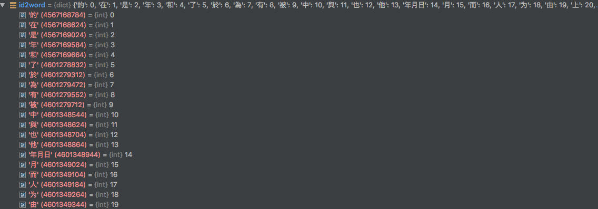
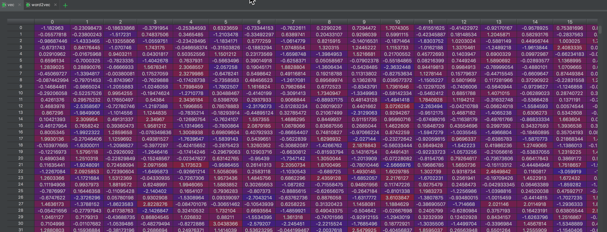

# Chatbot

## 如何安装依赖

在 Pycharm 集成环境中直接安装


## 项目文档结构

```python
# README相关
./readme_source # READEME图片存储位置

'''
词向量文件
'''
# 序列化后的词向量文件
# 具体介绍见下文
word2vec/vec.npy
word2vec/word2vec.npy
word2vec/id2word.pkl

'''
训练输入数据文件
'''
# CV集tfrecord
data/validation.tfrecords

# test集tfrecord
data/test.tfrecords

# train集tfrecord
data/train.tfrecords

#保存make_data文件的处理结果（Dataset对象）
data/dataset.pkl

#vocab_processor后的词频表
data/vocabulary.txt

#vocab_processor的对象文件
data/vocab_processor.bin
```

### 序列化后的词向量文件

#### id2word.pkl

#### 加载方式

```python
import file_process as fp

fp.load_obj('word2vec/id2word.pkl')
```

#### 数据类型

字典



#### word2vec.npy

`在训练时加载的是这个文件`

##### 加载方式

```python
import numpy as np

np.load('word2vec/word2vec.npy')
```

##### 数据类型

```python
nparray

第 0 列为单词字符串

第 1-300 为单词对应的词向量
```


#### vec.npy

#### 加载方式

```python
import numpy as np

np.load('word2vec/vec.npy')
```

#### 数据类型

```python
nparray

第 0-299 列为单词对应的词向量（和word2vec.npy文件对应，区别是vec.npy文件只有词向量）
```


